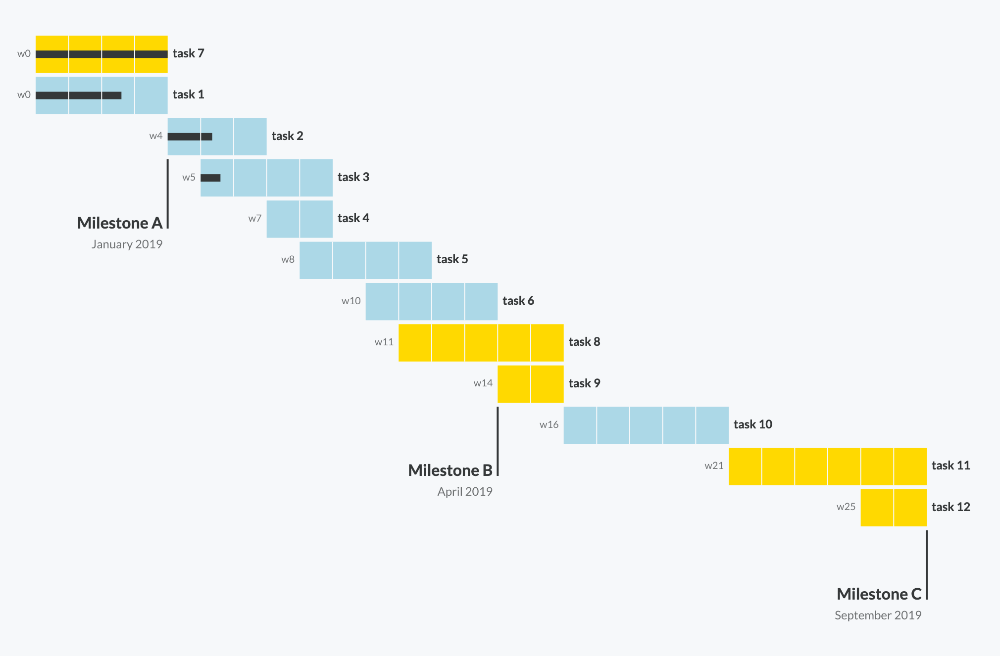

# &lt;gantt-chart&gt;

 [](https://www.webcomponents.org/element/gantt-chart)

Web component implementation of a Gantt chart.

<div align="center">



</div>

## Data model

```js
{
  milestones: [
    {
      id: 1,
      taskId: 6, // Graphical hint, it may be latest task in the milestone.
      title: 'Milestone A',
      additionalVerticalShift: 1 // Optional.
    },
    ...
  ],
  tasks: [
    {
      id: 1,
      title: 'task 1',
      start: 0, // week number
      duration: 4, // in weeks
      class: 'c1'
    },
    ...
  ]
}
```

## Exposed attributes

* `width`: chart width in pixels
* `height`: chart height in pixels

Margins attributes help to ensure task and milestone titles are visible.

* `margin-top`: space in pixel between the top border and the first task.
* `margin-bottom`: space in pixel between the bottom border and the last task.
* `margin-left`: space in pixel between the left border and the first task.
* `margin-right`: space in pixel between the right border and the last task.

See section [Usage](#usage) for an example.

## Exposed CSS Custom Properties


* `--font-family` defaults to `sans-serif`
* `--font-size` defaults to `12px`

Up to 10 classes can be passed:

* `--c1`, the task color defaults to `purple`
* `--c2`, the task color defaults to `blue`
* `--c3`, the task color defaults to `gold`

See section [Usage](#usage) for an example.

## Usage

In an html file

```html
<!DOCTYPE html>
<html>
  <head>
    <script type="module">
      import 'https://unpkg.com/gantt-chart@latest/dist/gantt-chart.umd.js';
    </script>
  </head>
  <style>
    @import url('https://fonts.googleapis.com/css?family=Lato:400,700&display=swap');
    /*
      CSS custom properties penetrate the Shadow DOM,
      they are useful to provide custom styling.
      The gantt-chart webcomponent exposes font-size and font-family custom properties.
    */
    ternary-plot {
      --font-family: 'Lato', sans-serif;
    }
  </style>
  <body>
    <!-- Set component attributes -->
    <gantt-chart
      width="1150"
      height="700"
      margin-top="40"
      margin-left="40"
      margin-right="40"
      margin-bottom="40"
    ></gantt-chart>
  </body>
  <script>
    const element = document.querySelector('gantt-chart');

    // Set gantt data: tasks and milestones.
    element.data = {
      milestones: [
        {
          id: 1,
          taskId: 6,
          title: 'Milestone A'
        },
      ],
      tasks: [
        {
          id: 1,
          title: 'task 1',
          start: 0,
          duration: 4,
          class: 'c1'
        },
      ]
    };
  </script>
</html>
```

With npm:

```
npm i gantt-chart
```

See [demo](https://stackblitz.com/edit/gantt-chart-example).

## License

MIT
